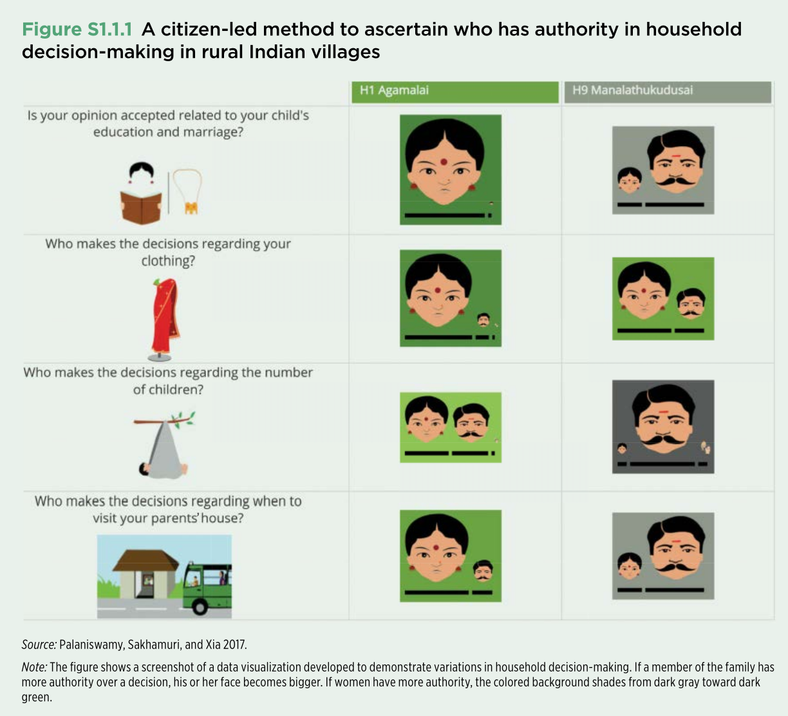

# Helping communities to gain the ability to collect and analyze their own data

## Overview

This case illustrates how data governance can be designed as a participatory process rather than imposed solely by governments, development agencies, or technical experts. In 2014, the World Bank’s Social Observatory and the Pudhu Vaazhvu Project in Tamil Nadu, India, developed a method known as **participatory tracking**. The initiative enabled rural communities—especially women, including many with limited literacy—to help define what should be measured, collect household-level data, interpret the results, and use the findings in local decision-making (see @palaniswamy_participatory_2017).

The project is relevant to the global study of data governance because it shows how institutions, community participation, technology, and data visualization can be combined to make data more legitimate, understandable, and useful.

## Institutional setting

The initiative built on two existing institutions in Tamil Nadu. The first was the system of democratically elected village councils, which convened open meetings to discuss and monitor local priorities and budgets. The second was a well-established network of women’s self-help groups with a presence across villages.

These institutions provided both a forum for using data and a trusted community structure for producing it. Rather than treating residents only as survey respondents, the project involved them as contributors to the design and governance of the data process.

## The participatory tracking process

Participatory tracking was implemented in three stages.

### 1. Community definition of indicators

Representatives from women’s groups in 200 villages discussed what a “good life” meant in their communities. They converted these priorities into indicators and survey questions, then tested the questions locally. The final questionnaire was designed to take no more than 30 minutes to complete.

This stage demonstrates an important data governance principle: decisions about what to measure are not neutral. By involving community members in defining indicators, the project aligned the data with local priorities and improved the relevance of the resulting evidence.

### 2. Community-based data collection and data protection

The questionnaire was incorporated into tablet-based software. One woman from each participating group received video-based training and then administered the survey in her village. During the pilot, participants collected census data from approximately 40,000 households in six weeks.

Survey responses were transmitted directly to a cloud server. This reduced opportunities for local alteration of the records and created a clearer chain of custody for the data. The approach therefore combined decentralized data collection with centralized storage and integrity controls.

### 3. Co-design of accessible visualizations

Because about one-third of villagers could not read or write, conventional tables and text-heavy reports would have excluded many intended users. The Social Observatory therefore worked with community members to co-produce visualizations that communicated findings through images, size, and color.

The figure below presents one example. It compares patterns of household decision-making across two villages. A larger face indicates that a family member has greater authority over a particular decision. Background color also conveys the balance of authority: darker green indicates greater decision-making power for women, while darker gray indicates greater authority for men. Village-level results are shown side by side to support comparison.

## Data governance concepts illustrated

This case highlights several elements of data governance that appear in different forms across national and international frameworks:

- **Participation and legitimacy:** Community members helped determine the indicators, making the data more responsive to local needs.
- **Institutional accountability:** Village councils provided a formal setting in which the evidence could inform public discussion and planning.
- **Data quality and integrity:** Standardized digital collection and direct transfer to a cloud server reduced opportunities for manipulation.
- **Inclusion and accessibility:** Visual methods were designed for people with different literacy levels, broadening access to the findings.
- **Data use and public value:** The purpose of the data was not only measurement. It was to improve deliberation, reveal differences in household authority, and support collective decision-making.
- **Shared governance:** Responsibility was distributed among community groups, local institutions, development practitioners, and technical systems.

## Significance for the global landscape of data governance

Many data governance frameworks emphasize rules for privacy, security, access, quality, and accountability. This case adds another dimension: effective governance also depends on who participates in defining the data and whether the results can be understood and used by the people represented in it.

The initiative shows that data governance can operate across multiple levels. International development organizations can provide resources and technical expertise; regional programs can coordinate implementation; local institutions can create legitimacy and accountability; and citizens can shape the meaning and use of the data. The model therefore offers an example of governance that is both institutional and citizen-led.

The broader lesson is that trustworthy data systems require more than technical infrastructure. They also require social processes that establish relevance, inclusion, and shared ownership.

## Questions for discussion

1. Who had authority over the main stages of the data lifecycle in this project: indicator design, collection, storage, interpretation, and use?
2. What are the advantages and risks of storing community-collected data on a centralized cloud server?
3. How did the use of visual symbols address barriers related to literacy, and what new interpretation risks might such symbols create?
4. In what ways does this model differ from a conventional government survey or externally managed development assessment?
5. Which features of the approach could be transferred to other countries, and which depend on the specific institutional context of Tamil Nadu?

